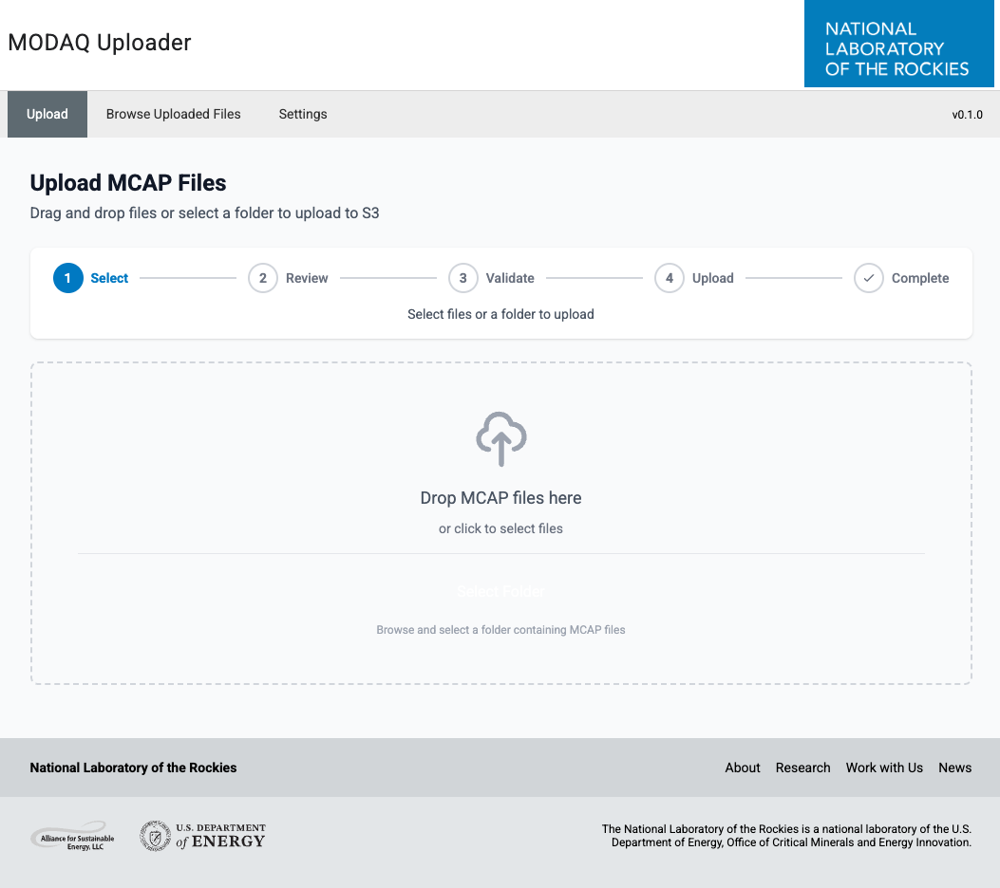

# MODAQ Upload

A Python based local web application for uploading MODAQ files to S3 with progress tracking, duplicate detection, and configuration.



## Features

- Drag-and-drop file upload - Select individual files or entire folders
- MCAP timestamp extraction - Automatically extracts timestamps using modaq_toolkit
- Hive-partitioned S3 paths - Files are organized by `year/month/day/hour/minute`
- Duplicate detection - Checks if files already exist in S3 before uploading
- Real-time progress - Server-Sent Events (SSE) for live upload progress
- S3 file browser - Navigate and search uploaded files
- Application updates - Built-in git pull and pip install functionality
- NLR branding - Official NLR color palette and styling

## Installation

### Prerequisites

- Python 3.11 or higher
- AWS credentials configured in `~/.aws/credentials`
- Access to an S3 bucket

### Setup

1. Clone the repository:

```bash
git clone <repository-url>
cd modaq_upload
```

2. Create a virtual environment:

```bash
python -m venv venv
source venv/bin/activate  # On Windows: venv\Scripts\activate
```

3. Install dependencies:

```bash
pip install -r requirements.txt
```

4. (Optional) Install development dependencies:

```bash
pip install -r requirements-dev.txt
```

## Usage

### Running the Application (Development)

```bash
python app.py
```

The application will be available at `http://localhost:5000`.

### Production Deployment (Linux)

For production use on a Linux machine, use the automated installation script which sets up a systemd service with Gunicorn.

#### Quick Install

```bash
cd deploy
sudo python3 install.py
```

This will:

- Install system dependencies (python3, python3-venv, git)
- Create a `modaq` system user
- Copy the application to `/opt/modaq-upload`
- Create a Python virtual environment and install dependencies
- Set up logging at `/var/log/modaq-upload`
- Install and enable a systemd service

#### Post-Installation Setup

1. Configure AWS credentials for the modaq user:

```bash
sudo -u modaq aws configure --profile default
```

2. Edit the application settings:

```bash
sudo nano /opt/modaq-upload/settings.json
```

3. The application runs at `http://localhost:8080`

#### Service Management

Check status

```bash
sudo systemctl status modaq-upload
```

View logs

```bash
sudo journalctl -u modaq-upload -f
```

Restart after config changes

```bash
sudo systemctl restart modaq-upload
```

Stop the service

```bash
sudo systemctl stop modaq-upload
```

#### Uninstall

```bash
cd deploy
sudo python3 uninstall.py
```

### Configuration

Settings can be configured in two ways:

#### Option 1: Environment Variables (Recommended for deployment)

Create a `.env` file in the project root:

```bash
cp .env.example .env
```

Edit `.env` with your settings:

```bash
# AWS Profile name from ~/.aws/credentials
MODAQ_AWS_PROFILE=<profile_name>

# AWS Region
MODAQ_AWS_REGION=<AWS region, e.g. us-west-2>

# S3 Bucket name for uploads
MODAQ_S3_BUCKET=<your-bucket-name>

# Default folder to open when selecting files (optional)
MODAQ_DEFAULT_UPLOAD_FOLDER=</path/to/mcap/files>

# Custom display name shown in the header (optional)
MODAQ_DISPLAY_NAME=<My Custom Name>
```

Environment variables take precedence over settings configured in the web UI.

#### Option 2: Web UI

1. Navigate to the Settings page
2. Select your AWS profile from the dropdown
3. Enter your S3 bucket name
4. Click Test Connection to verify access
5. Click Save Settings

Settings are saved to `settings.json` (gitignored).

### Uploading Files

1. Go to the Upload page
2. Drag and drop MCAP files or click to select
3. Review the analysis results showing timestamps and S3 paths
4. Check "Skip duplicates" to avoid re-uploading existing files
5. Click Upload Files to start
6. Monitor progress in real-time

### Browsing Files

1. Go to the Browse Files page
2. Navigate through the Hive-partitioned folder structure
3. Use the search box to find specific files

### Updating the Application

1. Go to Settings > Application Updates
2. Click Check for Updates to see if updates are available
3. Click Update Application to:
   - Pull latest changes from git
   - Reinstall Python dependencies
   - Update modaq_toolkit to the latest version
4. Restart the application after updating

## S3 Path Format

Files are uploaded to S3 using a Hive-partitioned path format:

```
year=YYYY/month=MM/day=DD/hour=HH/minute=M0/filename.mcap
```

Where:

- Minutes are rounded to 10-minute buckets (00, 10, 20, 30, 40, 50)
- Timestamps are extracted from the MCAP file data

## Development

### Running Tests

```bash
pytest tests/ -v
```

With coverage:

```bash
pytest tests/ --cov=app --cov-report=html
```

### Python Linting

```bash
ruff check app/ tests/
ruff format app/ tests/
```

### Python Type Checking

```bash
mypy app/
```

### JavaScript Linting (Biome)

```bash
npm run lint          # Check
npm run lint:fix      # Auto-fix
```

### JavaScript Type Checking

```bash
npm run typecheck     # tsc --checkJs via jsconfig.json
```

### JavaScript Testing (Vitest)

```bash
npm run test          # Run all JS tests
npm run test:watch    # Watch mode
npm run test:coverage # With coverage report
```

### All JS Checks

```bash
npm run check         # Biome + tsc + Vitest
```

## Architecture

See [docs/ARCHITECTURE.md](docs/ARCHITECTURE.md) for project structure and API endpoint reference.

## License

BSD 3-Clause License. See [LICENSE](LICENSE) for details.
