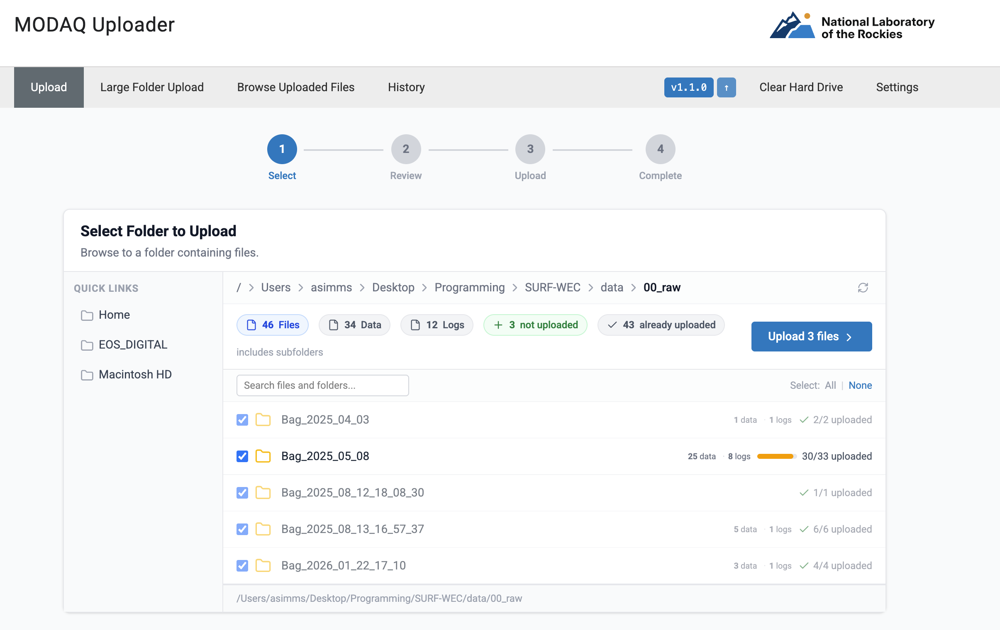
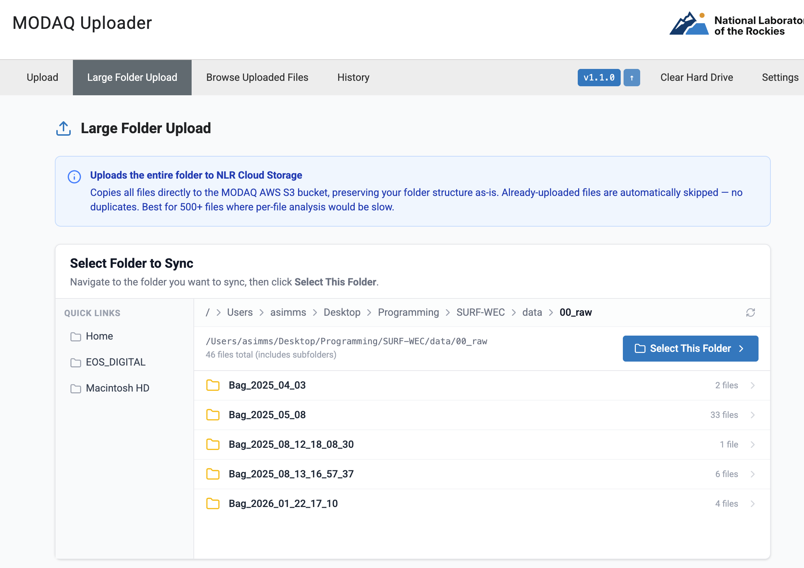
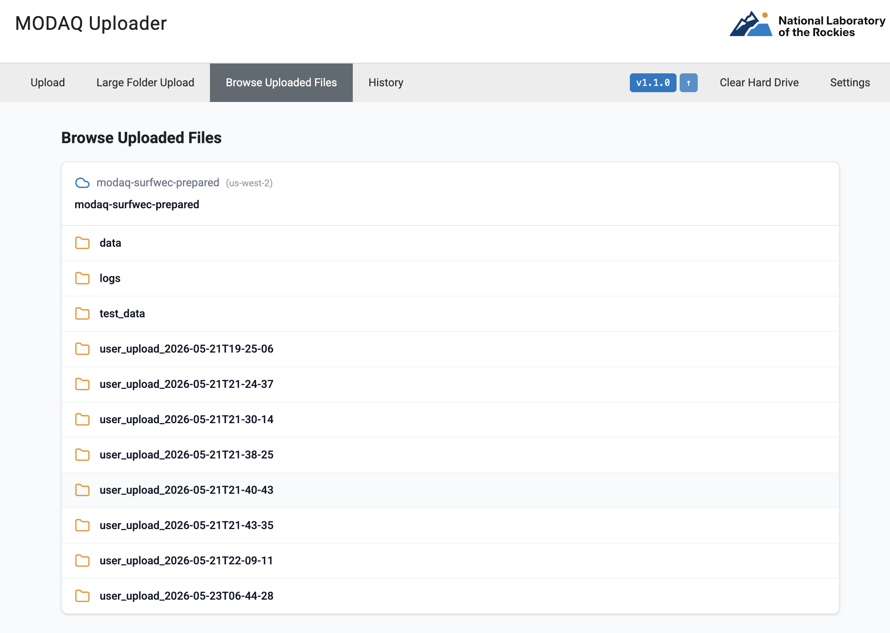
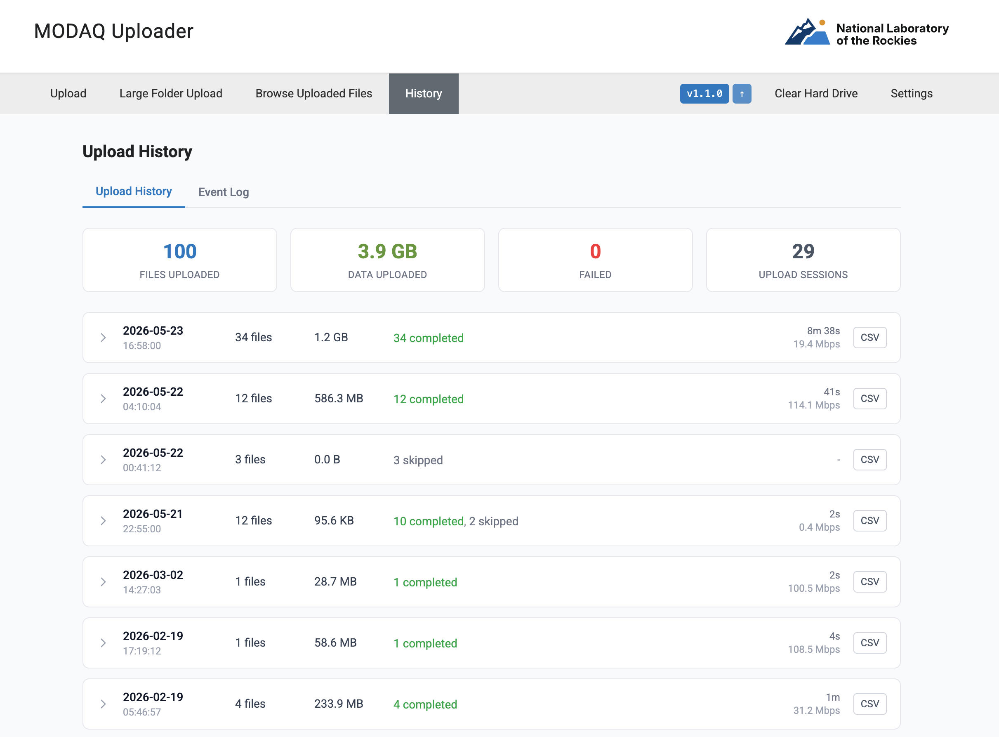
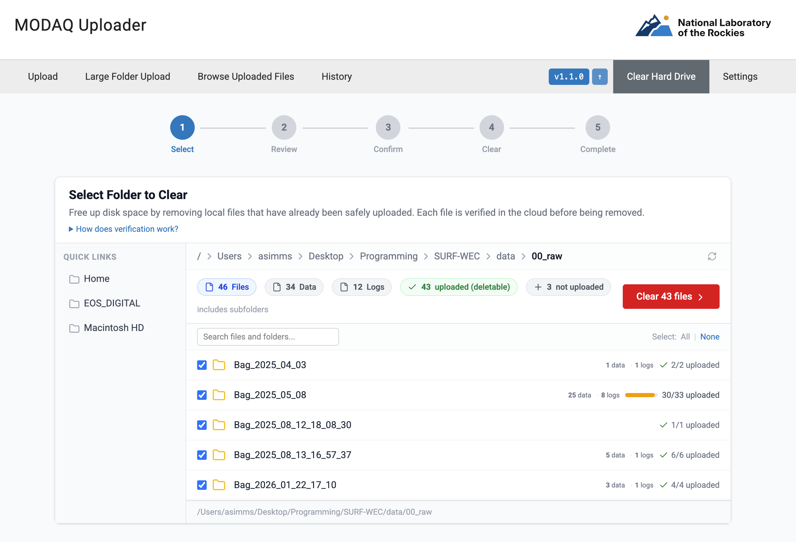
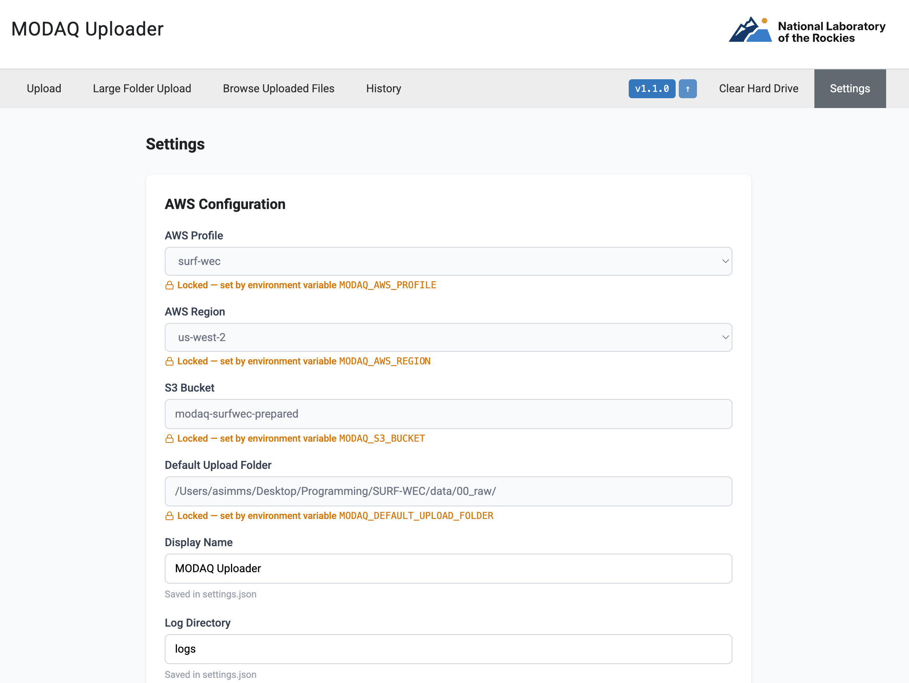
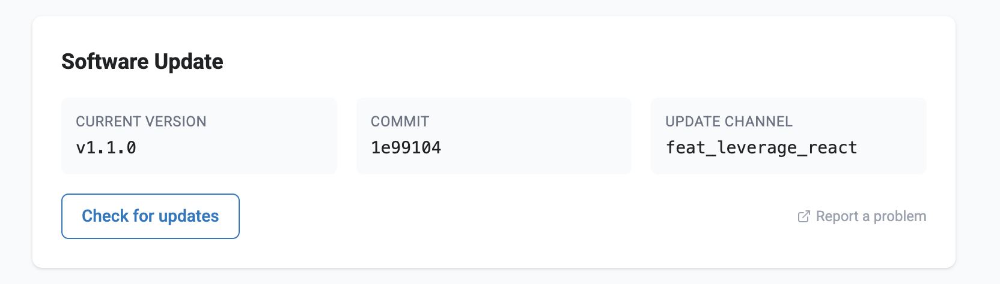

# MODAQ Upload

A Python based local web application for uploading MODAQ files to S3 with progress tracking, duplicate detection, and configuration.



## Features

- Drag-and-drop file upload - Select individual files or entire folders
- MCAP timestamp extraction - Automatically extracts timestamps using modaq_toolkit
- Hive-partitioned S3 paths - Files are organized by `year/month/day/hour/minute`
- Duplicate detection - Checks if files already exist in S3 before uploading
- Real-time progress - Server-Sent Events (SSE) for live upload progress
- S3 file browser - Navigate and search uploaded files
- Application updates - Built-in git pull and pip install functionality
- NLR branding - Official NLR color palette and styling

## Installation

### Prerequisites

- Python 3.11 or higher
- AWS credentials configured in `~/.aws/credentials`
- Access to an S3 bucket

### Setup

1. Clone the repository:

```bash
git clone <repository-url>
cd modaq_upload
```

2. Create a virtual environment:

```bash
python -m venv venv
source venv/bin/activate  # On Windows: venv\Scripts\activate
```

3. Install Python dependencies:

```bash
pip install -r requirements.txt
```

4. Install frontend dependencies and build the UI:

```bash
cd frontend && npm install && npm run build && cd ..
```

## Usage

### Running the Application

```bash
python app.py
```

The application will be available at `http://localhost:5000`.

### Development (Live Reload)

Run the Flask backend and Vite frontend separately for hot-reload during development:

Terminal 1: Flask API (port 5000):

```bash
python app.py
```

Terminal 2: Vite dev server (port 3000):

```bash
cd frontend && npm run dev
```

Open `http://localhost:3000`. The Vite server proxies `/api` requests to Flask.
After making frontend changes you're happy with, rebuild for production:

```bash
cd frontend && npm run build
```

### Production Deployment (Linux)

For production use on a Linux machine, use the automated installation script which sets up a systemd service with Gunicorn.

#### Quick Install

```bash
cd deploy
sudo python3 install.py
```

This will:

- Install system dependencies (python3, python3-venv, git)
- Create a `modaq` system user
- Copy the application to `/opt/modaq-upload`
- Create a Python virtual environment and install dependencies
- Set up logging at `/var/log/modaq-upload`
- Install and enable a systemd service

#### Post-Installation Setup

1. Configure AWS credentials for the modaq user:

```bash
sudo -u modaq aws configure --profile default
```

2. Edit the application settings:

```bash
sudo nano /opt/modaq-upload/settings.json
```

3. The application runs at `http://localhost:8080`

#### Service Management

Check status

```bash
sudo systemctl status modaq-upload
```

View logs

```bash
sudo journalctl -u modaq-upload -f
```

Restart after config changes

```bash
sudo systemctl restart modaq-upload
```

Stop the service

```bash
sudo systemctl stop modaq-upload
```

#### Uninstall

```bash
cd deploy
sudo python3 uninstall.py
```

### Configuration

Settings can be configured in two ways:

#### Option 1: Environment Variables (Recommended for deployment)

Create a `.env` file in the project root:

```bash
cp .env.example .env
```

Edit `.env` with your settings:

```bash
# AWS Profile name from ~/.aws/credentials
MODAQ_AWS_PROFILE=<profile_name>

# AWS Region
MODAQ_AWS_REGION=<AWS region, e.g. us-west-2>

# S3 Bucket name for uploads
MODAQ_S3_BUCKET=<your-bucket-name>

# Default folder to open when selecting files (optional)
MODAQ_DEFAULT_UPLOAD_FOLDER=</path/to/mcap/files>

# Custom display name shown in the header (optional)
MODAQ_DISPLAY_NAME=<My Custom Name>
```

Environment variables take precedence over settings configured in the web UI.

#### Option 2: Web UI

1. Navigate to the Settings page
2. Select your AWS profile from the dropdown
3. Enter your S3 bucket name
4. Click Test Connection to verify access
5. Click Save Settings

Settings are saved to `settings.json` (gitignored).

### Uploading Files

See [Application Guide: Upload](#upload) below for a walkthrough.

### Browsing Files

See [Application Guide: Browse Uploaded Files](#browse-uploaded-files) below.

### Updating the Application

See [Application Guide: Updating the Software](#updating-the-software) below.

## Application Guide

### Upload


The Upload page walks you through uploading files in four steps: Select → Review → Upload → Complete.

1. Navigate to the folder containing your MCAP files using the file browser. Quick Links on the left give fast access to common locations.
2. The browser shows each subfolder's upload status: data file count, log file count, and how many have already been uploaded to S3.
3. Check or uncheck folders to include or exclude them. Use Select All / None or search to filter.
4. Click Upload N files to proceed to the Review step, where you can inspect the per-file S3 destination paths before committing.
5. Already-uploaded files are skipped; no duplicates are created.

For more than 500 files, use [Large Folder Upload](#large-folder-upload) instead.


### Large Folder Upload



The Large Folder Upload page syncs an entire folder tree to S3 without per-file analysis. Use this when you have 500+ files and don't need to inspect each file's timestamp individually.

1. Navigate to the root folder you want to sync.
2. Click Select This Folder to confirm.
3. The folder structure is copied to S3 as-is. Already-uploaded files are skipped.


### Browse Uploaded Files



The Browse Uploaded Files page lets you navigate the contents of your S3 bucket directly from the app.

1. Click any folder to drill down into it.
2. Use the breadcrumb trail at the top to navigate back up.
3. This is useful for verifying that uploads landed in the correct location.


### History



The History page keeps a record of every upload session run from this machine.

- Upload History tab: each session's date, file count, data transferred, transfer speed, and outcome (completed / skipped / failed). Click any row to expand the per-file breakdown. Use CSV to export a session log.
- Event Log tab: application events for troubleshooting.

The running totals at the top (files uploaded, total data, failed, sessions) summarise all sessions.


### Clear Hard Drive



The Clear Hard Drive page removes local files that have already been uploaded to S3. Files are verified against S3 before any deletion.

1. Navigate to the folder you want to clean up.
2. The browser shows how many files are uploaded (deletable) vs not yet uploaded.
3. Only uploaded files are deleted; files not yet in S3 are not touched.
4. Click Clear N files and confirm to proceed through the workflow (Select → Review → Confirm → Clear → Complete).


### Settings



The Settings page controls the AWS connection used for all uploads and browsing.

- AWS Profile: profile from `~/.aws/credentials` to use.
- AWS Region: region of your S3 bucket.
- S3 Bucket: bucket files are uploaded to.
- Default Upload Folder: pre-populates the file browser on the Upload page.
- Display Name: title shown in the application header.
- Log Directory: where upload history logs are stored.

Fields marked *Locked: set by environment variable* are controlled by your `.env` file and cannot be changed from the UI (see [Configuration](#configuration)).


### Updating the Software

#### v1.1 and later: in-app update

From v1.1 onwards, updates can be applied from within the app.

Option A: via Settings:

1. Click Settings in the navigation bar.
2. Scroll down to the Software Update section.
3. Click Check for updates.



4. If updates are available, click Update Application. This pulls the latest code, reinstalls Python dependencies, and updates `modaq_toolkit`.
5. Restart the application after the update completes (`Ctrl+C` then `python app.py`, or restart the systemd service).

Option B: via the About modal:

1. Click the version badge (e.g. v1.1.0) in the navigation bar to open the About modal.
2. Expand the Software Update section and follow the same steps.

#### Before v1.1: manual update

If you are running a version prior to v1.1, the in-app updater is not available. Update manually from the terminal:

```bash
cd modaq_upload
git pull
source venv/bin/activate   # On Windows: venv\Scripts\activate
pip install -r requirements.txt
cd frontend && npm install && npm run build && cd ..
```

Then restart the application:

```bash
python app.py
```

Or, if running as a systemd service:

```bash
sudo systemctl restart modaq-upload
```

## S3 Path Format

Files are uploaded to S3 using a Hive-partitioned path format:

```
year=YYYY/month=MM/day=DD/hour=HH/minute=M0/filename.mcap
```

Where:

- Minutes are rounded to 10-minute buckets (00, 10, 20, 30, 40, 50)
- Timestamps are extracted from the MCAP file data

## Development

### Running Tests

```bash
pytest tests/ -v
```

With coverage:

```bash
pytest tests/ --cov=app --cov-report=html
```

### Python Linting

```bash
ruff check app/ tests/
ruff format app/ tests/
```

### Python Type Checking

```bash
mypy app/
```

### Install Development Dependencies

```bash
pip install -r requirements-dev.txt
```

### JavaScript Linting (Biome)

```bash
cd frontend && npm run lint          # Check
cd frontend && npm run lint:fix      # Auto-fix
```

### JavaScript Type Checking

```bash
cd frontend && npm run typecheck
```

### JavaScript Testing (Vitest)

```bash
cd frontend && npm run test          # Run all JS tests
cd frontend && npm run test:watch    # Watch mode
cd frontend && npm run test:coverage # With coverage report
```

### All JS Checks

```bash
cd frontend && npm run check   # Biome + tsc + Vitest
```

## Architecture

See [docs/ARCHITECTURE.md](docs/ARCHITECTURE.md) for project structure and API endpoint reference.

## License

BSD 3-Clause License. See [LICENSE](LICENSE) for details.
